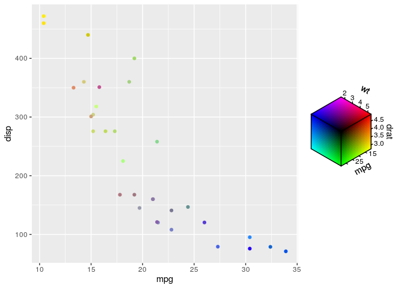

<!-- README.md is generated from README.Rmd. Please edit that file -->

# ggchromatic

*/ʤiː-ʤiːkrəʊˈmætɪk/*

<!-- badges: start -->

[](https://www.tidyverse.org/lifecycle/#experimental)
<!-- badges: end -->

The ‘ggchromatic’ package provides additional colour and fill scales to
use with ‘ggplot2’ It uses the ‘ggplot2’ extension system to map a
number of variables to different colour spaces with the ‘farver’
package. The package introduces ‘chromatic scales’, a term mirroring
music terms. In music, chromatic scales cover all 12 notes. In
ggchromatic, a chromatic scale can cover all channels in colour space.

## Installation

You can install the development of ggchromatic version from
[GitHub](https://github.com/) with:

``` r
# install.packages("devtools")
devtools::install_github("teunbrand/ggchromatic")
```

## Example

These is a basic example of mapping three variables to the RGB colour
space. This happens automatically for colours constructed by
`rgb_spec()`.

``` r
library(ggchromatic)
#> Loading required package: ggplot2

ggplot(mtcars, aes(mpg, disp)) +
  geom_point(aes(colour = rgb_spec(mpg, drat, wt)))
```

 The
associated scale functions give more options for customisation, like the
HSV scale below.

``` r
df <- data.frame(
  x = as.vector(row(volcano)),
  y = as.vector(col(volcano)),
  z = as.vector(volcano)
)

ggplot(df, aes(x, y, fill = hsv_spec(z, x, y))) +
  geom_raster() +
  scale_fill_hsv(limits = list(h = c(NA, 170)),
                 oob = scales::oob_squish,
                 channel_limits = hsv_spec(c(0, 0.8), c(0, 1), c(0, 1))) +
  coord_equal()
```


